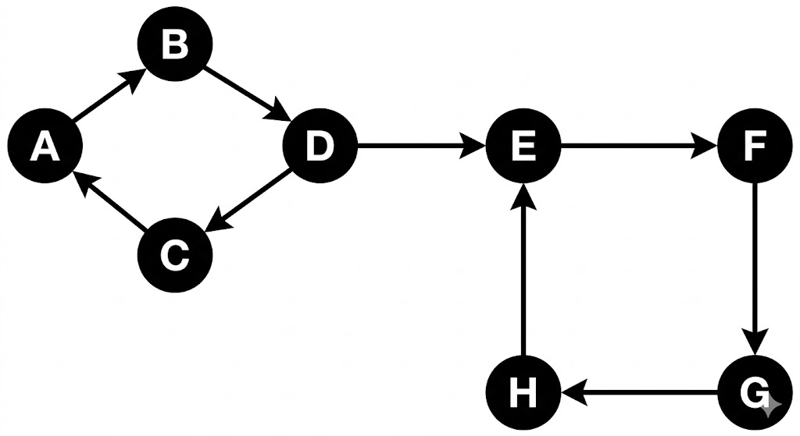

# Componentes Fortemente Conexas (SCC) em Grafos – Tarjan & Kosaraju

## Sumário

- [Estrutura de diretórios](#estrutura-de-diretórios)

- [O que é um grafo?](#o-que-é-um-grafo)

- [DFS](#depth-first-search)

- [Componentes Fortemente Conectados](#componentes-fortemente-conectados)

- [Kosaraju](#algoritmo-de-kosaraju)

- [Tarjan](#algoritmo-de-tarjan)


### Versionamento de código

O versionamento do projeto foi realizado utilizando [_Git_](https://git-scm.com/) e [_Github_](https://docs.github.com/pt), permitindo o controle das alterações ao longo do desenvolvimento. A criação de *branches* possibilitou o desenvolvimento isolado de funcionalidades, enquanto o uso de *pull requests* garantiu a revisão e a integração organizada das modificações ao repositório principal, promovendo um fluxo colaborativo entre os integrantes do grupo.

### Geração de inputs (carga de dados)

A geração das cargas de dados, estruturadas como diferentes *workloads*, foi realizada por meio da linguagem **Python**, escolhida por sua simplicidade, legibilidade e alto nível de abstração. Foram desenvolvidos scripts específicos para a criação de cenários distintos de teste, permitindo a simulação de entradas com comportamentos variados.

### Plotagem (geração) de gráficos

A geração dos gráficos foi realizada a partir dos dados experimentais armazenados em arquivos no formato `.csv`, os quais continham os resultados obtidos durante a execução dos testes. Para a visualização e análise desses dados, utilizou-se a biblioteca *Matplotlib* na linguagem **Python**, permitindo a construção de gráficos que representam o comportamento e o desempenho dos algoritmos avaliados.

## Estrutura de diretórios
---

# Introdução teórica


### O que é um grafo?

Considere a figura a seguir, a qual representa um mapa de vias de trânsito:


Figura 1.0


Essas vias podem ser representadas diagramicamente por pontos ligados entre linhas: os pontos P, Q, R e S são chamados de vértices, as linhas são chamadas de arestas e todo o diagrama é chamade de grafo. Note que a intersectção entre as linhas PR e QS não é um vértice uma vez que não corresponde a um cruzamento, isto é, não é um ponto onde as ruas se encontram. O conceito de grau de um vértice qualquer é a quantidade de arestas que terminam nesse vértice; é o mesmo que dizer qual o número de ruas em um dado cruzamento na figura acima. Por exemplo, o grau do vértice P é 3.

 

Figura 1.1


O grafo na figura 1.1 pode, além de um mapa de estradas, representar diversas coisas: uma rede elétrica, moléculas ou redes neurais, essencialmente, portanto, um  grafo é uma representação de um conjunto de pontos e as ligações entre eles. Na computação são extremamente uteis para lidar com problemas relacionados a rede de computadores com conexões via WI-FI ou cabo entre roteadores, rede sociais e a conexão de usuários que seguem um ao outro, ou até a internet com páginas da web conectadas através de um link.

Agora imagine que as vias possuem sentido único, ou seja, há apenas uma direção a se seguir de um cruzamento há outro; isto nada mais é que  um novo grafo de um tipo especial chamado grafo direcionado: há apenas um sentido entre dois vértices.


Figura 1.2

## Depth First Search
 
Se é preciso encontrar uma informação específica, há de se ter uma forma  de procurá-la sistematicamente no grafo, o que muitas vezes envolve olhar todos os seus vértices até que isso seja possível. Nesse sentido, há dois algoritmos bem conhecidos, **depth first search** e **breadth first search**, ambos percorrem por todos os vértices, mas em ordens diferentes. Como nesse trabalho tratamos de algoritmos baseados no depth first search (também chamado de DFS), apenas trataremos dele.

No *depth first search*, procuramos o mais fundo possível no grafo. Esse algoritmo explora um caminho e segue por ele até que não seja possível mais avançar, e então retorna para o  vértice de início e explora outro caminho ainda inexplorado, similar a explorar um labirinto sempre por um único caminho de corredores até o fim e após isso retornar ao ponto de início para fazer o mesmo por outro caminho, caso esse exista.
 

Figura 2.0

Na figura 2.0, que se trata de um grafo direcionado, tomando o vértice A como o inicial, o caminho seguido pelo algoritmo seria A → B → D → C → E → F → G → H. Note que, após não encontrar nenhum vértice inexplorado no ponto C, o algorito tem que retornar até encontrar um caminho ainda não explorado, repetindo o mesmo processo para esse.

---

## Componentes Fortemente Conectados

Em um grafo dirigido G, diz-se que ele é fortemente conectado quando, para todo par de vértices u e v, existe um caminho de u até v e, ao mesmo tempo, um caminho de v até u. Em outras palavras, qualquer vértice pode ser alcançado a partir de qualquer outro.

No entanto, um grafo dirigido pode não ser fortemente conectado como um todo. Nesse caso, a forte conectividade pode ocorrer em apenas partes do grafo. Dizemos que dois vértices u e v são fortemente conectados entre si quando existe um caminho de u até v e outro de v até u, mesmo que u = v. Assim, mesmo que G não seja fortemente conectado, ele pode ser decomposto em subconjuntos de vértices nos quais, internamente, todo par u e v é mutuamente alcançável. Cada um desses subconjuntos induz um subgrafo chamado Componente Fortemente Conectado (CFC). Essa ideia é melhor compreendida ao observar-se o exemplo:


---

# Algoritmo de Kosaraju

### Visão Geral

O algoritmo de Kosaraju, também conhecido como algoritmo Kosaraju-Sharir, é um algoritmo que encontra componentes fortemente conectados (SCC) de um grafo direcionado em tempo linear O(V + E) quando representado por lista de adjascência, onde V é o número de vértices (ou nós) e E o número de arestas do grafo. 

A implementação utilizada constrói explicitamente o grafo transposto em memória, o que usa espaço adicional O(V + E), mas simplifica a implementação e o entendimento em relação a abordagens que evitam essa construção explícita. A ideia é usar busca em profundidade duas vezes, fazendo uso da propriedade de que um grafo e seu transposto possuem exatamente os mesmos SCCs.

Vamos usar o grafo direcionado abaixo como exemplo para executar o algoritmo de Kosaraju.


## Execução do Algortimo
### Primeira Etapa

Qual o nosso objetivo inicial? primeiro, devemos criar uma pilha que representa a ordem de saída dos vértices através de uma busca em profundidade e guardamos os vértices já visitados. A DFS faz chamadas recursivas para cada vizinho não visitado, e ao retornar de todas essas chamadas — ou seja, quando não há mais vizinhos a explorar — o vértice é adicionado à pilha. 

Podemos começar a DFS por qualquer vértice, mas por convenção iremos utilizar o 1. Realizando a busca, visitamos o 1 e vemos a quem ele esta ligado. Vemos que ele está ligado ao 2, então visitamos o 2, e vemos que ele está ligado ao 3, visitamos o 3. Como o 3 não tem mais vizinhos não visitados, ele é adicionado à pilha. A recursão retorna para o 2, que também não tem mais vizinhos, e é adicionado. Por fim o 1 é adicionado. 

```
pilha     = [3, 2, 1]
visitados = {1, 2, 3}
```

Ainda existem vértices não visitados, iniciamos uma nova DFS a partir do vértice 4, escolhido arbitrariamente dentre os não visitados. Visitando o 4, vemos que ele tem o 3 e o 5 como vizinhos, o 3 já foi visitado, mas o 5 não. Visitamos 5 e vemos que ele está ligado ao 6, visitamos o 6. O 6 está ligado ao 4, que já foi visitado, então adicionamos o 6 à pilha, e a recursão retorna para o 5, que é adicionado, e por fim o 4 é adicionado.

```
pilha     = [3, 2, 1, 6, 5, 4]
visitados = {1, 2, 3, 4, 5, 6}
```

Ainda temos nós não visitados, o 9. O 9 está ligado ao 4, que já foi visitado, então o 9 é adicionado na pilha. Finalmente, nossa pilha está completa, pois não temos mais nós para visitar.

```
pilha     = [3, 2, 1, 6, 5, 4, 9]
visitados = {1, 2, 3, 4, 5, 6, 9}
```

### Segunda Etapa

Agora, o próximo passo é inverter a direção de todas as arestas do grafo, a fim de encontrar o seu transposto. Para cada vértice u do grafo, percorremos seus vizinhos v e adicionamos u como vizinho de v no grafo transposto — ou seja, toda aresta u → v vira v → u. O processo é feito em O(V + E), visitando cada vértice e cada aresta exatamente uma vez.


Por que queremos o transposto do grafo? Sabemos que um SCC possui caminhos nos dois sentidos entre todos os seus vértices, ou seja, é por definição bidirecional. Ao invertermos as arestas, essa característica se preserva — o que era ciclo continua sendo ciclo. Porém, as arestas que conectavam SCCs distintos agora apontam na direção oposta, bloqueando a DFS de vazar de um SCC para outro. Isso nos permite, na segunda DFS, explorar exatamente um SCC por vez. 

### Terceira Etapa

Feito isso, realizamos a segunda busca em profundidade, agora no grafo transposto. Retiramos os vértices do topo da pilha um a um — lembrando que o topo representa o vértice que terminou por último na primeira DFS, ou seja, o de maior alcance. Para cada vértice retirado que ainda não foi visitado, criamos um novo SCC e iniciamos uma DFS no grafo transposto para encontrar todos os seus vértices. Todos os vértices alcançados nessa DFS pertencem ao mesmo SCC. Vértices já visitados são ignorados, pois já foram atribuídos a um componente. Ao esvaziarmos a pilha, temos todos os SCCs do grafo identificados. 

Dando início a execução desta parte final, aplicamos a busca em profundidade no elemento do topo da pilha, que é o vértice 9. Como ele não foi visitado, iniciamos a DFS para montar seu SCC. Percebemos que ele não tem vizinhos no grafo transposto, portanto o 9 sozinho já é um SCC. 

```
pilha      = [3, 2, 1, 6, 5, 4]
visitados2 = {9}
SCCs       = [[9]]
```

Temos pilha = [3, 2, 1, 6, 5, 4], o topo é o 4. Como ele não foi visitado, iniciamos a DFS para montar seu SCC. Visitamos o 4 e vemos que ele está conectado ao 6. Visitamos o 6, vemos que está conectado ao 5. Visitamos o 5, e ele está conectado ao 4, que já foi visitado, encerrando as chamadas recursivas. Os vértices 4, 5 e 6 formam o segundo SCC. 

```
pilha      = [3, 2, 1]
visitados2 = {9, 4, 5, 6}
SCCs       = [[9], [4, 5, 6]]
```

Temos pilha = [3, 2, 1]. O próximo topo é o 1, que não foi visitado, então iniciamos a DFS para montar seu SCC. O 1 está ligado ao 3, visitamos, que está ligado ao 2, visitamos. O 2 está ligado ao 1, que já foi visitado, encerrando a DFS. Os vértices 1, 2 e 3 formam o terceiro SCC. 

```
pilha      = []
visitados2 = {9, 4, 5, 6, 1, 2, 3}
SCCs       = [[9], [4, 5, 6], [1, 2, 3]]
```

Nossa pilha está vazia, portanto encerrou a execução do algoritmo. Finalmente, descobrimos que o nosso grafo do exemplo possui três componentes fortemente conectados.


Temos os SCCs {9}, {4, 5, 6} e {1, 2, 3}.

O conceito é simples e o Kosaraju é eficiente, no entanto, não é mais eficiente que outros algoritmos que encontram SCCs como o Tarjan, que embora tenha uma complexidade de tempo assintoticamente igual ao Kosaraju, realiza apenas uma busca em profundidade, ao invés de duas, levando-o a ser mais rápido na prática.


---

# Algoritmo de Tarjan
### Visão Geral

Dado um grafo direcionado, queremos identificar quais conjuntos de vértices estão conectados de forma que todos conseguem alcançar todos os outros. O algoritmo de Tarjan resolve esse problema encontrando todas as Componentes Fortemente Conectadas (SCCs) utilizando apenas uma busca em profundidade (DFS), com complexidade linear O(V + E). A ideia central é detectar, durante a própria DFS, quando um grupo de vértices forma um ciclo fechado, sem precisar realizar múltiplas passagens pelo grafo.

### Ideia do Algoritmo

Durante a DFS, ao explorar um vértice u, surge a pergunta fundamental: existe algum caminho que permita alcançar novamente um vértice visitado anteriormente que ainda faz parte da exploração atual? Para medir isso, o algoritmo associa dois valores a cada vértice: id[u], que representa a ordem de visita na DFS, e low[u], chamado de low-link value (LLK), que representa o menor id alcançável a partir de u, incluindo ele próprio, considerando apenas vértices que ainda estão ativos na pilha da DFS. Em termos intuitivos, low[u] responde à pergunta: qual é o vértice mais antigo ainda ativo que consigo alcançar partindo de u?

### Atualização do Low-Link

Ao explorar uma aresta u → v, existem dois casos. Se v ainda não foi visitado, executamos DFS em v e depois propagamos a informação de retorno fazendo low[u] = min(low[u], low[v]), permitindo que ciclos encontrados mais profundamente influenciem vértices ancestrais. Se v já foi visitado, precisamos verificar se ele ainda pertence à exploração atual, caso pertença, encontramos um caminho de retorno dentro da mesma componente e atualizamos low[u] = min(low[u], id[v]). Essa distinção é essencial para evitar misturar componentes diferentes.

### Uso da Pilha

O Tarjan utiliza uma pilha para manter um invariante importante: apenas vértices cujo componente ainda não foi finalizada podem influenciar cálculos de low-link. Quando um vértice é visitado, ele é colocado na pilha e permanece lá enquanto sua SCC ainda está sendo construída. Quando uma componente é descoberta, todos os seus vértices são removidos da pilha. Assim, apenas vértices presentes na pilha podem atualizar valores low, impedindo que SCCs já concluídas interfiram nas próximas.

### Detecção de uma SCC

Após explorar todos os vizinhos de um vértice u, verificamos a condição id[u] == low[u]. Se ela for verdadeira, significa que não existe caminho retornando para um vértice mais antigo na DFS, logo u é o início de uma componente fortemente conectada. Nesse momento removemos vértices da pilha até remover u; todos os vértices removidos formam exatamente uma SCC. Uma SCC é definida como um conjunto de vértices onde qualquer vértice alcança qualquer outro e existe caminho de ida e volta entre todos eles, sendo que cada vértice do grafo pertence exatamente a uma única SCC.

### Fluxo Geral do Algoritmo

Inicializamos todos os vértices como não visitados e executamos DFS a partir de cada vértice ainda não explorado. Ao visitar um nó, atribuímos id e low, inserimos o vértice na pilha e exploramos seus vizinhos atualizando os valores de low-link conforme os casos descritos. Sempre que id == low, removemos vértices da pilha formando uma nova componente fortemente conectada. Cada vértice e cada aresta são processados apenas uma vez, garantindo complexidade O(V + E) em tempo e O(V) em memória.

### Intuição Final

Podemos interpretar o algoritmo da seguinte forma: id indica quando entramos em um vértice, low indica quão longe conseguimos voltar na exploração, e a pilha representa os vértices ainda ativos na DFS. Quando não é mais possível voltar para vértices anteriores, uma região do grafo se fecha e uma SCC é identificada. Dessa maneira, o algoritmo de Tarjan encontra todas as componentes fortemente conectadas em uma única passagem pelo grafo, de forma eficiente e elegante.


Vamos tomar como exemplo o seguinte grafo:


Com as arestas: 3→1, 1→2, 2→1.

---

### Estruturas auxiliares

Antes de iniciar a DFS, criamos as seguintes estruturas:

**ids**: array de tamanho igual ao número de vértices, iniciado com -1. O valor de ids[u] não representa o valor do node, mas sim o momento(o id) em que ele foi visitado durante a DFS. Enquanto ids[u] == -1, o node ainda não foi visitado.

**low**: array de mesmo tamanho, iniciado com 0. Guarda o menor id acessível a partir de cada node, considerando os nós ainda na stack. É através do low que conseguimos identificar a raiz de um SCC.

**id**: variável que age como um "relógio", incrementada a cada novo node visitado, determinando a ordem de visita.

**stack**: array que funciona como pilha, armazenando os nodes visitados ainda não atribuídos a algum SCC.

**onStack**: array booleano que nos diz, em O(1), se um node está atualmente na stack. Essencial para a atualização correta do low.

Estado inicial:

```
ids     = [-1, -1, -1]
low     = [ 0,  0,  0]
stack   = [ 0,  0,  0]
onStack = [false, false, false]
id = 0
```

---

### Execução

Iteramos pelos nodes. O node 1 tem ids[1] == -1, chamamos DFS(1), atribuímos ids[1] = low[1] = 0, incrementamos id e adicionamos à stack:

```
ids     = [0, -1, -1]  |  low = [0, 0, 0]  |  id = 1
stack   = [1,  0,  0]  |  onStack = [true, false, false]
```

Node 1 tem vizinho 2, não visitado, chamamos DFS(2), atribuímos ids[2] = low[2] = 1, incrementamos id e adicionamos à stack:

```
ids     = [0, 1, -1]  |  low = [0, 1, 0]  |  id = 2
stack   = [1, 2,  0]  |  onStack = [true, true, false]
```

Node 2 tem vizinho 1, já visitado e na stack, então atualizamos low[2] = min(low[2], ids[1]) = min(1, 0) = 0:

```
ids     = [0, 1, -1]  |  low = [0, 0, 0]  |  id = 2
stack   = [1, 2,  0]  |  onStack = [true, true, false]
```

DFS(2) retorna. ids[2]=1 != low[2]=0, node 2 não é raiz de SCC. Voltando ao node 1, propagamos low[1] = min(low[1], low[2]) = min(0, 0) = 0. Node 1 não tem mais vizinhos. ids[1] == low[1]? 0 == 0, sim! Desempilhamos até o node 1, formando o primeiro SCC: **{2, 1}**:

```
ids     = [0, 1, -1]  |  low = [0, 0, 0]  |  id = 2
stack   = [0, 0,  0]  |  onStack = [false, false, false]
```

Continuamos a iteração. O node 3 tem ids[3] == -1, chamamos DFS(3), atribuímos ids[3] = low[3] = 2, incrementamos id e adicionamos à stack:

```
ids     = [0, 1, 2]  |  low = [0, 0, 2]  |  id = 3
stack   = [3, 0, 0]  |  onStack = [false, false, true]
```

Node 3 tem vizinho 1, já visitado mas **fora da stack** (onStack[1] == false), portanto não atualizamos o low. DFS(3) retorna. ids[3] == low[3]? 2 == 2, sim! Desempilhamos formando o segundo SCC: **{3}**:

```
ids     = [0, 1, 2]  |  low = [0, 0, 2]  |  id = 3
stack   = [0, 0, 0]  |  onStack = [false, false, false]
```

Todos os nodes foram visitados. SCCs encontrados: **{1, 2}** e **{3}**.

O node 3 forma um SCC sozinho pois, apesar de alcançar o node 1, não há caminho de volta até ele, ou seja, não há ciclo envolvendo o node 3.


---

## Contribuintes

- [@KalebeSouza-dev - Kalebe Souza](https://github.com/KalebeSouza-dev)

- [@00joaoguilherme - Joao Guilherme](https://github.com/00joaoguilherme)

- [@2004gustavoPaiva - Luis Gustavo](https://github.com/2004gustavoPaiva)

- [@RenanAF18 - Savio Renan](https://github.com/RenanAF18)

- [@SavioCartaxo - Savio Cartaxo](https://github.com/SavioCartaxo)

Projeto feito como trabalho final da disciplina de Estrutura de Dados e Algoritmos (EDA) e Laboratório de Estrutura de Dados e Algoritmos (LEDA) da graduação em Ciência da Computação na Universidade Federal de Campina Grande (UFCG) no período 2025.2.