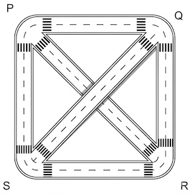
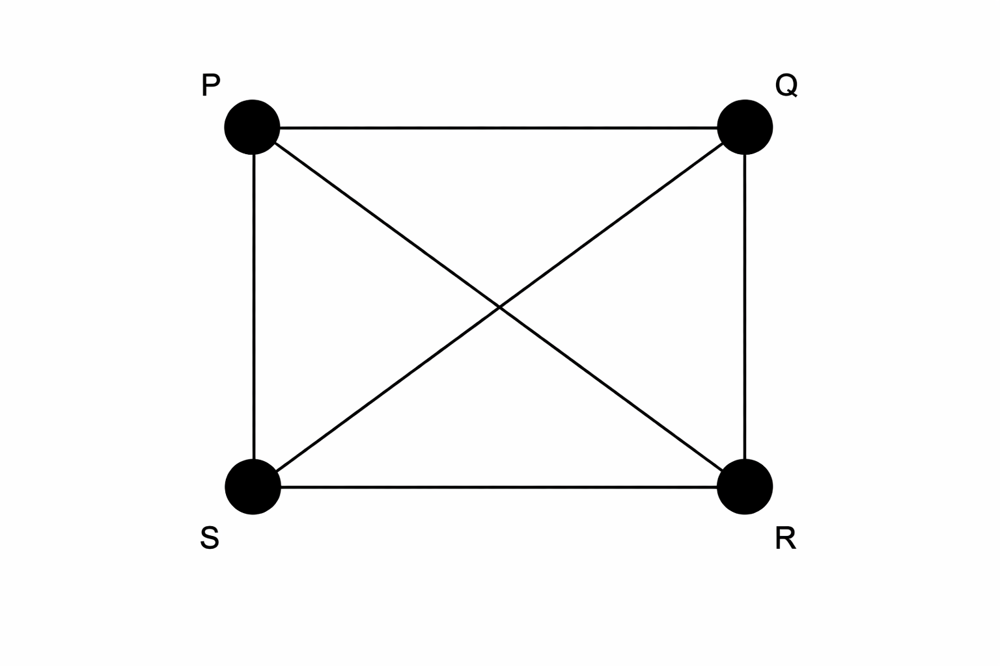
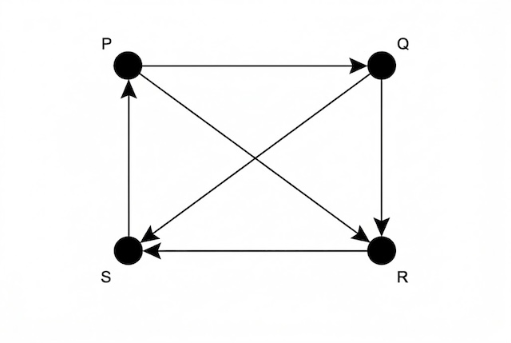
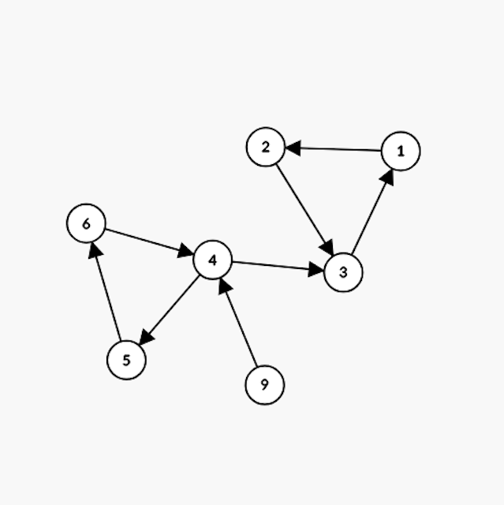
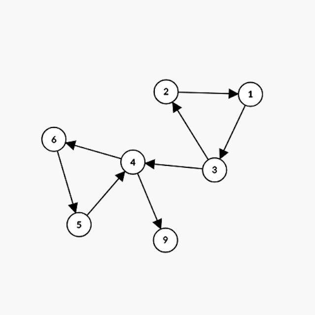
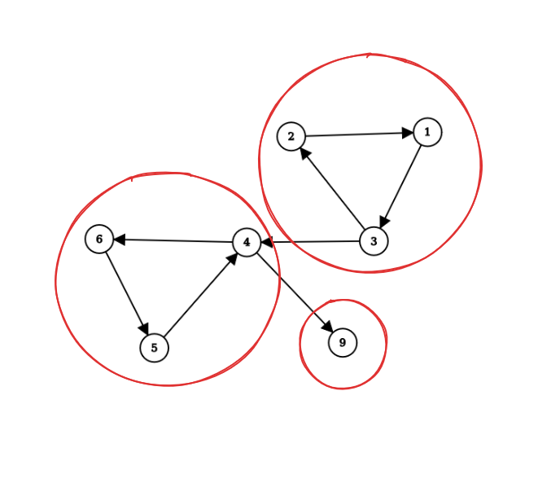
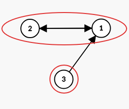
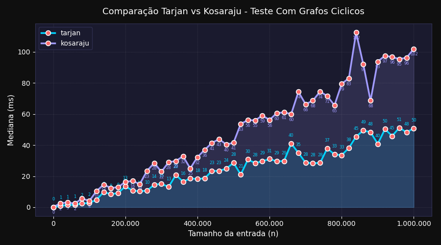
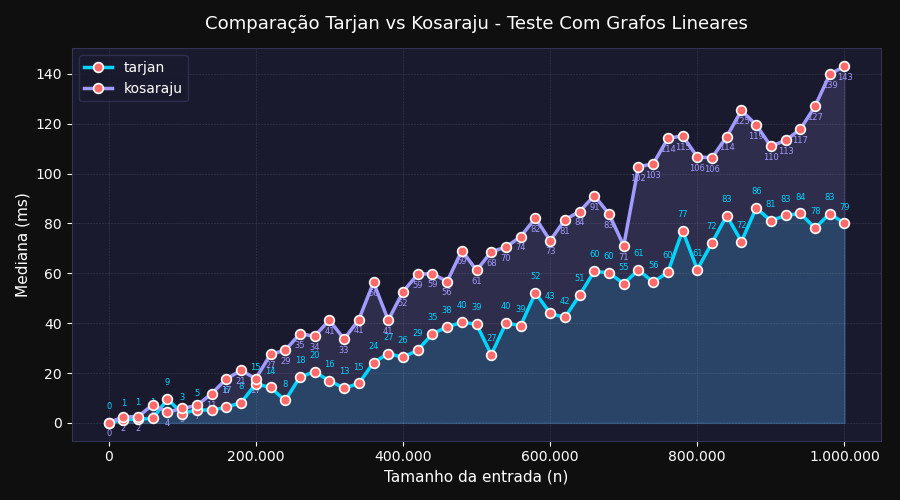
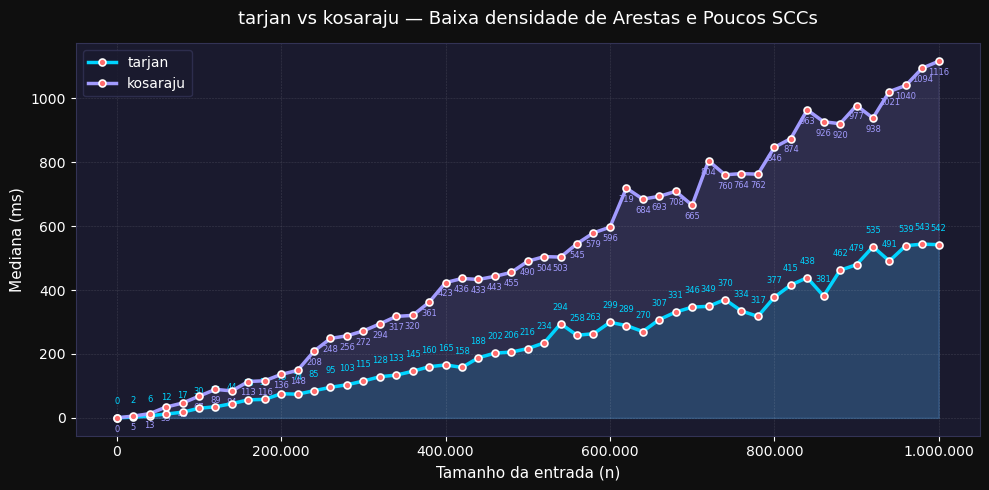

# Componentes Fortemente Conexos (SCC) em Grafos – Tarjan & Kosaraju

## Sumário

- [Estrutura de diretórios](#estrutura-de-diretórios)

- [O que é um grafo?](#o-que-é-um-grafo)

- [DFS](#depth-first-search-dfs)

- [Componentes Fortemente Conectados](#componentes-fortemente-conectados-sccs)

- [Algoritmo de Kosaraju](#algoritmo-de-kosaraju)

- [Algoritmo de Tarjan](#algoritmo-de-tarjan)

- [Scripts](#scripts)

- [Testes Unitários](#testes-unitários)

- [Experimento](#experimento)

- [Ambiente isolado com Docker](#uso-do-docker-no-projeto-de-benchmark-scc)

- [Conclusão](#conclusão)

- [Referências](#referências)


### Versionamento de código

O versionamento do projeto foi realizado utilizando [_Git_](https://git-scm.com/) e [_Github_](https://docs.github.com/pt), permitindo o controle das alterações ao longo do desenvolvimento. A criação de *branches* possibilitou o desenvolvimento isolado de funcionalidades, enquanto o uso de *pull requests* garantiu a revisão e a integração organizada das modificações ao repositório principal, promovendo um fluxo colaborativo entre os integrantes do grupo.

### Geração de inputs (carga de dados)

A geração das cargas de dados, estruturadas como diferentes *workloads*, foi realizada por meio da linguagem **Python**, escolhida por sua simplicidade, legibilidade e alto nível de abstração. Foram desenvolvidos scripts específicos para a criação de cenários distintos de teste, permitindo a simulação de entradas com comportamentos variados.

### Plotagem (geração) de gráficos

A geração dos gráficos foi realizada a partir dos dados experimentais obtidos durante a execução dos testes. 
Um script de carga foi utilizado para executar os experimentos e produzir a saída contendo as métricas de desempenho dos algoritmos avaliados. 
Com base nesses resultados, foram construídos gráficos para análise comparativa.

Para a visualização dos dados, utilizou-se a biblioteca *Matplotlib* na linguagem **Python**, permitindo representar graficamente o comportamento e o desempenho dos algoritmos.

## Estrutura de diretórios

---

### Estrutura geral do projeto

O projeto está organizado nos seguintes diretórios:

```
scc-graph-project
├───docker
├───lib
├───scripts
└───src
```

### Diretório src

```
src
├───main
│   └───java
│       └───algoritmos
└───test
    └───java
        ├───testes
        └───util
```

O diretório `src` contém as implementações, em **Java**, dos algoritmos **Kosaraju** e **Tarjan**, dentre outros auxiliares. Também está presente o diretório `test`, responsável pelas classes de teste do projeto.

### Diretório scripts

```
scripts
├───generate_inputs
└───plot_graphs
```

O diretório `scripts` reúne os scripts desenvolvidos em **Python** utilizados no suporte aos experimentos realizados no projeto. Nele estão incluídos os scripts responsáveis pela **geração automática das entradas (workloads)** utilizadas nos testes e também os scripts encarregados da **geração de gráficos** a partir dos resultados obtidos, utilizando a biblioteca **Matplotlib**.

<br>

# Introdução teórica

### O que é um grafo?

Considere a figura a seguir, a qual representa um mapa de vias de trânsito:

<p align="center">
  
  <br>
  <em style="margin-left:40px;">Figura 1.0</em>
</p>

Essas vias podem ser representadas diagramaticamente por pontos ligados por linhas: os pontos P, Q, R e S são chamados de vértices, as linhas são chamadas de arestas e todo o diagrama é chamado de grafo. Note que a interseção entre as linhas PR e QS não é um vértice uma vez que não corresponde a um cruzamento, isto é, não é um ponto onde as ruas se encontram. O conceito de grau de um vértice qualquer é a quantidade de arestas que terminam nesse vértice, é o mesmo que dizer qual o número de ruas em um dado cruzamento na figura acima. Por exemplo, o grau do vértice P é 3.

 
<p align="center">
  
  <br>
  <em>Figura 1.1</em>
</p>

O grafo na figura 1.1 pode, além de um mapa de estradas, representar diversas coisas: uma rede elétrica, moléculas ou redes neurais; essencialmente, portanto, um grafo é uma representação de um conjunto de pontos e das ligações entre eles. Na computação são extremamente úteis para lidar com problemas relacionados à rede de computadores, com conexões via Wi-Fi ou cabo entre roteadores, redes sociais e a conexão de usuários que seguem um ao outro, ou até a internet com páginas da web conectadas através de links. 

Agora imagine que as vias possuem sentido único, ou seja, há apenas uma direção a se seguir de um cruzamento a outro; isso nada mais é que um novo grafo de um tipo especial chamado grafo direcionado: há apenas um sentido entre dois vértices.


<p align="center">
  
  <br>
  <em>Figura 1.2</em>
</p>

## Depth First Search (DFS)
 
Se é preciso encontrar uma informação específica, há de se ter uma forma de procurá-la sistematicamente no grafo, o que muitas vezes envolve olhar todos os seus vértices até que isso seja possível. Nesse sentido, há dois algoritmos bem conhecidos, [depth first search](src/main/java/algoritmos/DepthFirstSearch.java) e **breadth first search** (BFS), ambos percorrem todos os vértices, mas em ordens diferentes. Como neste trabalho tratamos de algoritmos baseados no **depth first search** (também chamado de **DFS**), apenas trataremos dele.

No *depth first search*, procuramos o mais fundo possível no grafo. Esse algoritmo explora um caminho e segue por ele até que não seja mais possível avançar, e então retorna para o vértice de início e explora outro caminho ainda inexplorado, similar a explorar um labirinto sempre por um único caminho de corredores até o fim e, após isso, retornar ao ponto de início para fazer o mesmo por outro caminho, caso esse exista.
 
<p align="center">
  
  <br>
  <em>Figura 1.3</em>
</p>

Na figura 1.3, que se trata de um grafo direcionado, tomando o vértice A como o inicial, o caminho seguido pelo algoritmo seria A → B → D → C → E → F → G → H. Note que, após não encontrar nenhum vértice inexplorado no ponto C, o algoritmo tem que retornar até encontrar um caminho ainda não explorado, repetindo o mesmo processo para esse.

---

## Componentes Fortemente Conectados (SCCs)

Em um grafo direcionado G, diz-se que ele é fortemente conectado quando, para todo par de vértices u e v, existe um caminho de u até v e, ao mesmo tempo, um caminho de v até u. Em outras palavras, qualquer vértice pode ser alcançado a partir de qualquer outro.

No entanto, um grafo direcionado pode não ser fortemente conectado como um todo. Nesse caso, a forte conectividade pode ocorrer em apenas partes do grafo. Dizemos que dois vértices u e v são fortemente conectados entre si quando existe um caminho de u até v e outro de v até u, mesmo que u = v. Assim, mesmo que G não seja fortemente conectado, ele pode ser decomposto em subconjuntos de vértices nos quais, internamente, todo par u e v é mutuamente alcançável. Cada um desses subconjuntos induz um subgrafo chamado **Componente Fortemente Conectado** ou **Strongly Connected Components (SCC)** que será como iremos chamá-los. Essa ideia é melhor compreendida ao observar o exemplo:

<p align="center">
  
  <br>
</p>

No exemplo acima, o grafo direcionado está dividido em 4 SCCs, destacados pelos círculos vermelhos. Em cada um desses grupos, todo vértice consegue alcançar qualquer outro vértice do mesmo grupo seguindo as direções das arestas.

Observe que o grafo completo não é fortemente conectado em si, pois não existe necessariamente um caminho entre todos os pares de vértices do grafo. Ainda assim, ele pode ser decomposto em subconjuntos de vértices nos quais a forte conectividade é preservada internamente - esses subconjuntos são justamente as SCCs.

Além disso, vale destacar que vértices isolados ou que não formam ciclos com outros vértices, como o vértice "8" do exemplo, também são considerados componentes fortemente conectados, pois, trivialmente, existe um caminho de um vértice para ele mesmo.

<br>

---

# Algoritmo de Kosaraju

## Visão Geral

O algoritmo de Kosaraju, também conhecido como algoritmo Kosaraju-Sharir, é um algoritmo que encontra componentes fortemente conectados (SCC) de um grafo direcionado em tempo linear O(V + E) quando representado por lista de adjacência, onde **V** é o número de vértices (ou nós) e **E** o número de arestas do grafo. 

A implementação utilizada constrói explicitamente o grafo transposto em memória, o que usa espaço adicional O(V + E), mas simplifica a implementação e o entendimento em relação a abordagens que evitam essa construção explícita. A ideia é usar busca em profundidade duas vezes, fazendo uso da propriedade de que um grafo e seu transposto possuem exatamente os mesmos SCCs.

Vamos usar o grafo direcionado abaixo como exemplo para executar o algoritmo de Kosaraju.

<p align="center">
  
  <br>
</p>

## Execução do Algoritmo
### Primeira Etapa

Qual o nosso objetivo inicial? Primeiro, devemos criar uma pilha que representa a ordem de saída dos vértices através de uma busca em profundidade e guardar os vértices já visitados. A versão da DFS usada para a explicação do algoritmo será a recursiva, pois ela é mais intuitiva e simples de entender. A DFS faz chamadas recursivas para cada vizinho não visitado, e ao retornar de todas essas chamadas, ou seja, quando não há mais vizinhos a explorar o vértice é adicionado à pilha.

Podemos começar a DFS por qualquer vértice, mas, por convenção, iremos utilizar o 1. Realizando a busca, visitamos o 1 e vemos a quem ele está ligado. Vemos que ele está ligado ao 2, então visitamos o 2, e vemos que ele está ligado ao 3; visitamos o 3. Como o 3 não tem mais vizinhos não visitados, ele é adicionado à pilha. A recursão retorna para o 2, que também não tem mais vizinhos e é adicionado. Por fim, o 1 é adicionado.

```
pilha     = [3, 2, 1]
visitados = {1, 2, 3}
```

Ainda existem vértices não visitados, iniciamos uma nova DFS a partir do vértice 4, escolhido arbitrariamente dentre os não visitados. Visitando o 4, vemos que ele tem o 3 e o 5 como vizinhos; o 3 já foi visitado, mas o 5 não. Visitamos o 5 e vemos que ele está ligado ao 6; visitamos o 6. O 6 está ligado ao 4, que já foi visitado, então adicionamos o 6 à pilha, e a recursão retorna para o 5, que é adicionado, e por fim o 4 é adicionado.

```
pilha     = [3, 2, 1, 6, 5, 4]
visitados = {1, 2, 3, 4, 5, 6}
```

Ainda temos nós não visitados: o 9. O 9 está ligado ao 4, que já foi visitado, então o 9 é adicionado à pilha. Finalmente, nossa pilha está completa, pois não temos mais nós para visitar.

```
pilha     = [3, 2, 1, 6, 5, 4, 9]
visitados = {1, 2, 3, 4, 5, 6, 9}
```

### Segunda Etapa

Agora, o próximo passo é inverter a direção de todas as arestas do grafo, a fim de encontrar o seu transposto. Para cada vértice u do grafo, percorremos seus vizinhos v e adicionamos u como vizinho de v no grafo transposto, ou seja, toda aresta u → v vira v → u. O processo é feito em O(V + E), visitando cada vértice e cada aresta exatamente uma vez.

<p align="center">
  
  <br>
</p>

Por que queremos o transposto do grafo? Sabemos que um SCC possui caminhos nos dois sentidos entre todos os seus vértices, ou seja, é, por definição, bidirecional. Ao invertermos as arestas, essa característica se preserva (o que era ciclo continua sendo ciclo). Porém, as arestas que conectavam SCCs distintos agora apontam na direção oposta, bloqueando a DFS de vazar de um SCC para outro. Isso nos permite, na segunda DFS, explorar exatamente um SCC por vez.

### Terceira Etapa

Feito isso, realizamos a segunda busca em profundidade, agora no grafo transposto. Retiramos os vértices do topo da pilha um a um, lembrando que o topo representa o vértice que terminou por último na primeira DFS, ou seja, o de maior alcance. Para cada vértice retirado que ainda não foi visitado, criamos um novo SCC e iniciamos uma DFS no grafo transposto para encontrar todos os seus vértices. Todos os vértices alcançados nessa DFS pertencem ao mesmo SCC. Vértices já visitados são ignorados, pois já foram atribuídos a um componente. Ao esvaziarmos a pilha, temos todos os SCCs do grafo identificados.

Dando início à execução desta parte final, aplicamos a busca em profundidade no elemento do topo da pilha, que é o vértice 9. Como ele não foi visitado, iniciamos a DFS para montar seu SCC. Percebemos que ele não tem vizinhos no grafo transposto; portanto, o 9 sozinho já é um SCC.

```
pilha      = [3, 2, 1, 6, 5, 4]
visitados2 = {9}
SCCs       = [[9]]
```

Temos pilha = [3, 2, 1, 6, 5, 4], o topo é o 4. Como ele não foi visitado, iniciamos a DFS para montar seu SCC. Visitamos o 4 e vemos que ele está conectado ao 6. Visitamos o 6, vemos que está conectado ao 5. Visitamos o 5, e ele está conectado ao 4, que já foi visitado, encerrando as chamadas recursivas. Os vértices 4, 5 e 6 formam o segundo SCC. 

```
pilha      = [3, 2, 1]
visitados2 = {9, 4, 5, 6}
SCCs       = [[9], [4, 5, 6]]
```

Temos pilha = [3, 2, 1]. O próximo topo é o 1, que não foi visitado, então iniciamos a DFS para montar seu SCC. O 1 está ligado ao 3, visitamos, que está ligado ao 2, visitamos. O 2 está ligado ao 1, que já foi visitado, encerrando a DFS. Os vértices 1, 2 e 3 formam o terceiro SCC. 

```
pilha      = []
visitados2 = {9, 4, 5, 6, 1, 2, 3}
SCCs       = [[9], [4, 5, 6], [1, 2, 3]]
```

Nossa pilha está vazia, portanto, encerrou a execução do algoritmo. Finalmente, descobrimos que o nosso grafo do exemplo possui três componentes fortemente conectados.


<p align="center">
  
  <br>
</p>


Temos os SCCs {9}, {4, 5, 6} e {1, 2, 3}.

O conceito é simples e o Kosaraju é eficiente; no entanto, não é mais eficiente que outros algoritmos que encontram SCCs, como o Tarjan, que, embora tenha uma complexidade de tempo assintoticamente igual à do Kosaraju, realiza apenas uma busca em profundidade, ao invés de duas, levando-o a ser mais rápido na prática.


<br><br>

---

# Algoritmo de Tarjan

## Visão Geral

Dado um grafo direcionado, queremos identificar quais conjuntos de vértices estão conectados de forma que todos conseguem alcançar todos os outros. Assim como o Kosaraju, o algoritmo de Tarjan resolve esse problema encontrando todas as Componentes Fortemente Conectadas (SCCs), porém utilizando apenas uma busca em profundidade (DFS), com complexidade linear O(V + E). A ideia central é detectar, durante a própria DFS, quando um grupo de vértices forma um ciclo fechado, sem precisar realizar múltiplas passagens pelo grafo.

### Ideia do Algoritmo

Durante a DFS, ao explorar um vértice u, surge a pergunta fundamental: existe algum caminho que permita alcançar novamente um vértice visitado anteriormente que ainda faça parte da exploração atual? Para medir isso, o algoritmo associa dois valores a cada vértice: id[u], que representa a ordem de visita na DFS, e low[u], chamado de low-link value (LLK), que representa o menor id alcançável a partir de u, incluindo ele próprio, considerando apenas vértices que ainda estão ativos na pilha da DFS. Em termos intuitivos, low[u] responde à pergunta: qual é o vértice mais antigo ainda ativo que consigo alcançar partindo de u?

### Atualização do Low-Link

Ao explorar uma aresta u → v, existem dois casos. Se v ainda não foi visitado, executamos DFS em v e depois propagamos a informação de retorno fazendo low[u] = min(low[u], low[v]), permitindo que ciclos encontrados mais profundamente influenciem vértices ancestrais. Se v já foi visitado, precisamos verificar se ele ainda pertence à exploração atual; caso pertença, encontramos um caminho de retorno dentro da mesma componente e atualizamos low[u] = min(low[u], id[v]). Essa distinção é essencial para evitar misturar componentes diferentes.

### Uso da Pilha

O Tarjan utiliza uma pilha para manter um invariante importante: apenas vértices cujo componente ainda não foi finalizado podem influenciar cálculos de low-link. Quando um vértice é visitado, ele é colocado na pilha e permanece lá enquanto seu SCC ainda está sendo construído. Quando um componente é descoberto, todos os seus vértices são removidos da pilha. Assim, apenas vértices presentes na pilha podem atualizar valores low, impedindo que SCCs já concluídos interfiram nos próximos.

### Detecção de uma SCC

Após explorar todos os vizinhos de um vértice u, verificamos a condição id[u] == low[u]. Se ela for verdadeira, significa que não existe caminho retornando para um vértice mais antigo na DFS; logo, u é o início de um componente fortemente conectado. Nesse momento, removemos vértices da pilha até remover u; todos os vértices removidos formam exatamente uma SCC. Uma SCC é definida como um conjunto de vértices onde qualquer vértice alcança qualquer outro e existe caminho de ida e volta entre todos eles, sendo que cada vértice do grafo pertence exatamente a uma única SCC.

### Fluxo Geral do Algoritmo

Inicializamos todos os vértices como não visitados e executamos DFS a partir de cada vértice ainda não explorado. Ao visitar um nó, atribuímos id e low, inserimos o vértice na pilha e exploramos seus vizinhos, atualizando os valores de low-link conforme os casos descritos. Sempre que id == low, removemos vértices da pilha formando um novo componente fortemente conectado. Cada vértice e cada aresta são processados apenas uma vez, garantindo complexidade O(V + E) em tempo e O(V) em memória.

### Intuição Final

Podemos interpretar o algoritmo da seguinte forma: id indica quando entramos em um vértice, low indica quão longe conseguimos voltar na exploração, e a pilha representa os vértices ainda ativos na DFS. Quando não é mais possível voltar para vértices anteriores, uma região do grafo se fecha e uma SCC é identificada. Dessa maneira, o algoritmo de Tarjan encontra todas as componentes fortemente conectadas em uma única passagem pelo grafo, de forma eficiente e elegante.

Vamos tomar como exemplo o seguinte grafo:

<p align="center">
  
  <br>
  <em>Figura 1.8</em>
</p>

Com as arestas: 3→1, 1→2, 2→1.

---

### Estruturas auxiliares

Antes de iniciar a DFS, criamos as seguintes estruturas:

**ids**: array de tamanho igual ao número de vértices, iniciado com -1. O valor de ids[u] não representa o valor do node, mas sim o momento(o id) em que ele foi visitado durante a DFS. Enquanto ids[u] == -1, o node ainda não foi visitado.

**low**: array de mesmo tamanho, iniciado com 0. Guarda o menor id acessível a partir de cada node, considerando os nós ainda na stack. É através do low que conseguimos identificar a raiz de um SCC.

**id**: variável que age como um "relógio", incrementada a cada novo node visitado, determinando a ordem de visita.

**stack**: array que funciona como pilha, armazenando os nodes visitados ainda não atribuídos a algum SCC.

**onStack**: array booleano que nos diz, em O(1), se um node está atualmente na stack. Essencial para a atualização correta do low.

Como os valores dos vértices podem ser arbitrários, cada nó recebe na entrada um índice contíguo de 0 a n-1, permitindo que as estruturas auxiliares sejam arrays primitivos acessados diretamente. Cada nó guarda dois valores: o índice normalizado, usado internamente pelo algoritmo para indexar as estruturas, e o valor original, usado apenas na saída para identificar os vértices de cada SCC. O custo do mapeamento é pago uma única vez na leitura da entrada.

```
Valor original:  10    57    23
Índice interno:   0     1     2
```
---

Estado inicial:
```
ids     = [-1, -1, -1]
low     = [ 0,  0,  0]
stack   = [ 0,  0,  0]
onStack = [false, false, false]
id = 0
```

### Execução

Iteramos pelos nodes. O node 1 tem ids[1] == -1, chamamos DFS(1), atribuímos ids[1] = low[1] = 0, incrementamos id e adicionamos à stack:

```
ids     = [0, -1, -1]  |  low = [0, 0, 0]  |  id = 1
stack   = [1,  0,  0]  |  onStack = [true, false, false]
```

Node 1 tem vizinho 2, não visitado, chamamos DFS(2), atribuímos ids[2] = low[2] = 1, incrementamos id e adicionamos à stack:

```
ids     = [0, 1, -1]  |  low = [0, 1, 0]  |  id = 2
stack   = [1, 2,  0]  |  onStack = [true, true, false]
```

Node 2 tem vizinho 1, já visitado e na stack, então atualizamos low[2] = min(low[2], ids[1]) = min(1, 0) = 0:

```
ids     = [0, 1, -1]  |  low = [0, 0, 0]  |  id = 2
stack   = [1, 2,  0]  |  onStack = [true, true, false]
```

DFS(2) retorna. ids[2]=1 != low[2]=0, node 2 não é raiz de SCC. Voltando ao node 1, propagamos low[1] = min(low[1], low[2]) = min(0, 0) = 0. Node 1 não tem mais vizinhos. ids[1] == low[1]? 0 == 0, sim! Desempilhamos até o node 1, formando o primeiro SCC: **{2, 1}**:

```
ids     = [0, 1, -1]  |  low = [0, 0, 0]  |  id = 2
stack   = [0, 0,  0]  |  onStack = [false, false, false]
```

Continuamos a iteração. O node 3 tem ids[3] == -1, chamamos DFS(3), atribuímos ids[3] = low[3] = 2, incrementamos id e adicionamos à stack:

```
ids     = [0, 1, 2]  |  low = [0, 0, 2]  |  id = 3
stack   = [3, 0, 0]  |  onStack = [false, false, true]
```

Node 3 tem vizinho 1, já visitado mas **fora da stack** (onStack[1] == false), portanto não atualizamos o low. DFS(3) retorna. ids[3] == low[3]? 2 == 2, sim! Desempilhamos formando o segundo SCC: **{3}**:

```
ids     = [0, 1, 2]  |  low = [0, 0, 2]  |  id = 3
stack   = [0, 0, 0]  |  onStack = [false, false, false]
```

Todos os nodes foram visitados. SCCs encontrados: **{1, 2}** e **{3}**.

O node 3 forma um SCC sozinho pois, apesar de alcançar o node 1, não há caminho de volta até ele, ou seja, não há ciclo envolvendo o node 3.

<br>

---

# Scripts

---

## Geração de Grafo Linear

Para a realização dos experimentos, foi utilizado um script responsável por gerar automaticamente grafos direcionados com *estrutura linear*. Nesse tipo de grafo, os vértices são organizados em sequência, onde cada vértice _i_ possui uma aresta direcionada para o vértice _i+1_, formando uma cadeia de nós conectados em uma única direção.

<p align="center">
  
  <br>
</p>

Como não existem caminhos de retorno entre os vértices, não há ciclos no grafo. Dessa forma, nenhum par de vértices é mutuamente alcançável. Consequentemente, cada vértice forma sua própria Componente Fortemente Conectada (SCC), resultando em _N_ SCCs para um grafo com _N_ vértices.

Esse tipo de estrutura permite avaliar o comportamento dos algoritmos de detecção de SCC em grafos sem ciclos, onde o número de componentes fortemente conectadas é máximo.

## Geração de Grafo Cíclico

Também foi utilizado um script para gerar grafos direcionados com *estrutura cíclica*. Nesse caso, cada vértice _i_ possui uma aresta para o vértice _i+1_, e o último vértice possui uma aresta que retorna para o primeiro, formando um único ciclo.

<p align="center">
  
  <br>
</p>

Nessa estrutura, existe um caminho entre qualquer par de vértices ao percorrer o ciclo, permitindo também o retorno ao vértice de origem. Assim, todos os vértices são mutuamente alcançáveis.

Portanto, todo o grafo forma uma única Componente Fortemente Conectada (SCC), independentemente do número de vértices.

## Geração de Grafo Aleatório

Sem dúvidas, uma questão importante do trabalho a ser respondida foi "Como gerar grafos generalizados e randômicos para tais algoritmos sem perder o controle de suas estruturas?" e o princípio de **controlled random graph** (grafo aleatório controlado) foi o caminho encontrado; consiste em gerar grafos randômicos com propriedades estruturais customizadas e controladas. Nesse projeto, isso se traduziu como uma maneira de gerar grafos com uma quantidade específica de SCCs, vértices e arestas, mesmo que mantendo uma certa aleatoriedade.

Em mais detalhes, foi feito um script responsável por gerar grafos direcionados a partir de três parâmetros: N, M e K, representando o número de vértices, arestas e SCCs, respectivamente. Todos os vértices são distribuídos randomicamente em K grupos, e dentro de cada grupo os vértices são ligados de maneira a formar um ciclo, garantindo que cada grupo seja um SCC isolado, identificado por um número inteiro como ID. Para completar as M arestas restantes, são sorteados pares de vértices aleatoriamente, com a condição de que uma aresta só pode ir do grupo de ID menor para o de ID maior. Isso gera um Grafo Acíclico Dirigido entre os grupos, garantindo que nenhum SCC isolado seja desfeito.

Para os experimentos, serão considerados valores de N = 10², 10³, 10⁴, 10⁵ e 10⁶. Os valores de M variam conforme a densidade do grafo: para grafos esparsos, M = 2N; para grafos moderadamente densos, M = 5N; para grafos densos, M = 10N. Os valores de K são definidos de forma a variar a quantidade de componentes, sendo K = N/30 para poucos SCCs, K = N/10 para uma quantidade moderada e K = N/3 para muitos SCCs pequenos.

<br>

---

# Testes Unitários

Para garantir a corretude dos algoritmos antes dos experimentos, foram desenvolvidos testes automatizados com **JUnit 5**, organizados em três classes de teste. 

A classe [`TestControlledGraph`](src/test/java/testes/TestControlledGraph.java) valida Tarjan e Kosaraju em grafos aleatórios controlados com parâmetros definidos de vértices, arestas e SCCs. 

A classe [`TestCyclicGraph`](src/test/java/testes/TestCyclicGraph.java) verifica se ambos os algoritmos retornam exatamente 1 SCC para grafos cíclicos, já que todos os vértices são mutuamente alcançáveis pelo ciclo. 

A classe [`TestLinearGraph`](src/test/java/testes/TestLinearGraph.java) confirma que, em grafos lineares sem ciclos, cada vértice forma sua própria SCC, resultando em N componentes. Para executar os testes no terminal:
```
javac -cp "lib\junit-platform-console-standalone-1.9.3.jar;src" -d out (Get-ChildItem -Recurse src -Filter *.java).FullName
java -jar lib\junit-platform-console-standalone-1.9.3.jar -cp out --scan-classpath
```
<br>

---

# Experimento

A experimentação compara o desempenho do algoritmo de Kosaraju com o de Tarjan para análise de tempo de execução e uso de memória. Ambos os algoritmos possuem complexidade de tempo O(V + E), onde V é o número de vértices e E o número de arestas do grafo, porém diferem significativamente em sua abordagem: o Tarjan realiza apenas uma busca em profundidade enquanto o Kosaraju realiza duas, além de construir explicitamente o grafo transposto em memória, resultando em complexidade de espaço O(V + E) contra O(V) do Tarjan. Essa diferença estrutural, embora invisível na notação assintótica, tem impacto direto no desempenho prático dos algoritmos, especialmente para entradas grandes. O objetivo é verificar empiricamente se essa diferença estrutural se reflete no desempenho prático dos algoritmos em termos de tempo de execução e uso de memória.

Os grafos foram gerados com entradas de N = 10² até N = 10⁶ vértices, com o número de arestas variando conforme o tipo de grafo — fixo para os casos linear e cíclico, e proporcional a N para os grafos aleatórios controlados.
O experimento foi realizado em uma máquina com as seguintes especificações:

## Especificações da Máquina

| Recurso | Especificação |
|--------|---------------|
| Processador | Intel Core i5-13450HX (13ª geração) |
| Núcleos disponíveis no experimento | 6 |
| Memória disponível | 8 GB |
| Ambiente de execução | Container Docker |

## Uso do Docker no Projeto de Benchmark SCC 

### Motivação

Para comparar algoritmos de SCC de forma cientificamente válida, é essencial que todos os testes rodem em um ambiente controlado e reproduzível. Sem Docker, fatores como versão do Java, configurações do sistema operacional e diferenças entre as máquinas dos membros do grupo comprometeriam a consistência dos resultados.

O Docker resolve isso empacotando o código, o compilador e o ambiente de execução em uma imagem isolada, garantindo que o benchmark rode da mesma forma em qualquer máquina.

### Implementação

A imagem base `maven:3.9-eclipse-temurin-21` já inclui Java 21 e Maven, eliminando dependências locais. Cada algoritmo é um serviço independente no [docker-compose.yml](docker-compose.yml), com limites de memória e CPU fixos e iguais para todos, tornando a comparação justa. O script [benchmark.sh](benchmark.sh) usa `docker compose run --rm`, criando e removendo o container a cada execução sem acumular estado entre testes.

Para a medição de memória, um container por execução é necessário. No benchmark de tempo todos os Ns rodam no mesmo processo, o que é eficiente mas impede medir o uso de memória (heap) de forma confiável, pois o coletor de lixo da JVM (Garbage Collector) não libera memória de forma determinística entre execuções. O `benchmark_memoria.sh` com seu `docker-compose.memoria.yml` dedicado resolve isso subindo um processo Java limpo para cada medição.

### Resultado

Isolamento de recursos, reprodutibilidade entre máquinas e condições idênticas de execução - tornando os resultados confiáveis tanto para tempo quanto para memória.

---

## Resultado - tempo de execução para grafos cíclicos e lineares

<p align="center">
  
  <br>
</p>

<p align="center">
  
  <br>
</p>

Os gráficos apresentam o tempo de execução dos algoritmos de Kosaraju e Tarjan para grafos cíclicos e lineares, com entradas variando de N = 10² até N = 10⁶ vértices.

Em ambos os casos, o comportamento geral está dentro do esperado para a complexidade O(V + E), com o tempo de execução crescendo de forma consistente conforme o aumento da entrada, sem saltos abruptos. O Tarjan se mostrou consistentemente mais rápido que o Kosaraju ao longo de toda a faixa de entrada testada, com a diferença se tornando progressivamente mais expressiva conforme N cresce.

Para entradas pequenas, a diferença entre os dois algoritmos é praticamente imperceptível, com ambos completando a execução em frações de milissegundo. À medida que a entrada cresce, a vantagem do Tarjan se acentua e para N = 10⁶, o Kosaraju leva aproximadamente o dobro do tempo do Tarjan em ambos os tipos de grafo, refletindo diretamente o custo das duas DFS e da construção explícita do grafo transposto.

Vale observar que os dados apresentam alguma variação pontual, especialmente para entradas intermediárias, comportamento esperado em benchmarks de tempo, influenciado por fatores como o garbage collector da JVM e variações de escalonamento do sistema operacional. A tendência geral, no entanto, é clara e consistente com a análise teórica.

<br>

---

## Resultado - tempo de execução para grafos aleatórios controlados

Para os experimentos com grafos aleatórios controlados, foram consideradas combinações entre três níveis de densidade: baixa (M = 2N), média (M = 5N) e alta (M = 10N); e três categorias de quantidade de SCCs: muitos (K = N/3), moderada (K = N/10) e poucos (K = N/30).

<table align="center">
  <tr>
    <td align="center">
      <br>
    <em>Grafo com baixa densidade (M = 2N) e poucos SCCs (K = N/30).</em>
  </td>

  <td align="center">
    <br>
      <em>Grafo com baixa densidade (M = 2N) e quantidade moderada de SCCs (K = N/10).</em>
  </td>
  </tr>

  <tr>
    <td align="center">
      <br>
    <em>Grafo com baixa densidade (M = 2N) e muitos SCCs (K = N/3).</em>
  </td>

  <td align="center">
    <br>
      <em>Grafo com densidade média (M = 5N) e poucos SCCs (K = N/30).</em>
  </td>
  </tr>

  <tr>
    <td align="center">
      <br>
    <em>Grafo com densidade média (M = 5N) e quantidade moderada de SCCs (K = N/10).</em>
  </td>

  <td align="center">
    <br>
      <em>Grafo com densidade média (M = 5N) e muitos SCCs (K = N/3).</em>
  </td>
  </tr>

  <tr>
    <td align="center">
      <br>
    <em>Grafo com alta densidade (M = 10N) e poucos SCCs (K = N/30).</em>
  </td>

  <td align="center">
    <br>
      <em>Grafo com alta densidade (M = 10N) e quantidade moderada de SCCs (K = N/10).</em>
    </td>
  </tr>
</table>

  <p align="center">
    
    <br>
    <em>Grafo com alta densidade (M = 10N) e muitos SCCs (K = N/3).</em>
  </p>

Ao analisar os gráficos, observa-se que o comportamento de ambos os algoritmos está dentro do esperado para a complexidade O(V + E), com o tempo de execução crescendo de forma consistente conforme o aumento da entrada. O Tarjan se mostrou consistentemente mais rápido que o Kosaraju em todos os cenários testados, com a diferença se acentuando conforme a entrada cresce. Para entradas de N = 10⁶, o Tarjan chegou a ser de 2x a 3x mais rápido que o Kosaraju, com a diferença sendo mais expressiva nos casos de maior densidade de arestas.


## Resultados do experimento de memória

| Entrada | Kosaraju cíclico (MB) | Tarjan cíclico (MB) | Kosaraju linear (MB) | Tarjan linear (MB) |
|---------|----------------------|---------------------|----------------------|--------------------|
| 10³     | 0                    | 0                   | 1                    | 0                  |
| 10⁴     | 3                    | 1                   | 4                    | 1                  |
| 10⁵     | 20                   | 8                   | 28                   | 15                 |
| 10⁶     | 211                  | 92                  | 294                  | 169                |

Os resultados de uso de memória confirmam a diferença teórica entre os dois algoritmos. O Tarjan, por realizar apenas uma busca em profundidade e utilizar exclusivamente estruturas auxiliares de tamanho proporcional ao número de vértices, como os arrays de ids, low e onStack, além da pilha, possui complexidade de espaço O(V). O Kosaraju, na implementação utilizada, constrói explicitamente o grafo transposto em memória, o que adiciona uma estrutura de tamanho proporcional a V + E, resultando em complexidade de espaço O(V + E). É importante destacar que essa não é uma limitação inerente ao algoritmo de Kosaraju em si, pois existem variações que evitam a construção explícita do transposto, reduzindo o uso de memória para O(V), porém à custa de maior complexidade de implementação.

Em ambos os tipos de grafo testados, o consumo de memória de ambos os algoritmos cresce conforme o esperado à medida que a entrada aumenta, com o Tarjan consistentemente utilizando menos memória que o Kosaraju. Essa diferença se torna mais expressiva para entradas grandes, refletindo diretamente o impacto da construção do grafo transposto no consumo de memória do Kosaraju. Vale ressaltar que os grafos utilizados nos testes de memória são esparsos, com E ≈ V, o que representa o cenário mais favorável para o Kosaraju. Em grafos mais densos, onde E cresce em relação a V, o grafo transposto ocuparia proporcionalmente mais memória, acentuando ainda mais a diferença em relação ao Tarjan, que manteria seu consumo em O(V) independentemente da densidade do grafo.

<br>

---

# Conclusão

Os resultados obtidos confirmam o que a análise teórica já sugeria: embora Kosaraju e Tarjan compartilhem a mesma complexidade de tempo assintótica O(V + E), o Tarjan se mostrou consistentemente mais rápido em todos os cenários testados, para ambos os tipos de grafo e em todas as entradas analisadas.

A diferença de desempenho se torna cada vez mais evidente conforme o tamanho da entrada cresce. Para entradas pequenas, ambos os algoritmos completam a execução em frações de milissegundo, tornando a diferença imperceptível na prática. À medida que a entrada cresce, a vantagem do Tarjan se acentua progressivamente. Para N = 10⁶, o Kosaraju levou aproximadamente o dobro do tempo do Tarjan tanto no grafo cíclico quanto no linear, padrão que se mostrou consistente ao longo de toda a faixa de entrada testada.

Nos experimentos com grafos aleatórios controlados, a diferença se mostrou ainda mais expressiva nos casos de maior densidade de arestas, chegando a aproximadamente 3x para M = 10N com N = 10⁶. Isso evidencia que o custo do Kosaraju cresce não apenas com o número de vértices, mas também com o número de arestas, já que o grafo transposto replica todas as E arestas do grafo original em memória. O Tarjan, por não construir o transposto e operar com estruturas auxiliares de tamanho O(V), mantém seu desempenho mais estável independentemente da densidade do grafo.

Vale destacar que os experimentos também revelaram um comportamento relevante relacionado à implementação recursiva: em grafos com ciclos longos, a profundidade da pilha de recursão impacta significativamente o desempenho, favorecendo a adoção da DFS iterativa para ambos os algoritmos. Com a DFS iterativa, o Tarjan passou a demonstrar sua vantagem de forma consistente, confirmando que a diferença de desempenho observada reflete genuinamente a diferença estrutural entre os algoritmos e não um artefato da implementação.

Conclui-se portanto que, apesar da equivalência assintótica, o Tarjan é superior ao Kosaraju tanto em desempenho quanto em uso de memória. A principal vantagem do Kosaraju reside na sua simplicidade conceitual e facilidade de implementação, pois a ideia de duas DFS com inversão do grafo é mais intuitiva do que o mecanismo de *low-link values* utilizado pelo Tarjan, o que justifica seu uso em contextos didáticos ou quando a clareza do código é prioritária em relação à performance.

<br>

---

# Referências

- [CP-Algorithms](https://cp-algorithms.com/graph/strongly-connected-components.html)
- [Graph-editor](https://csacademy.com/app/graph_editor/)
- [Wikipedia](https://en.wikipedia.org/wiki/Kosaraju%27s_algorithm)
- [IME-USP](https://www.ime.usp.br/~pf/algoritmos_para_grafos/aulas/kosaraju.html)
- [Introduction to algorithms, CORMEN, Thomas H.](https://www.amazon.com.br/Introduction-Algorithms-Eastern-Economy-Thomas/dp/8120340078)

<br>

---

# Contribuintes

- [@KalebeSouza-dev - Kalebe Souza](https://github.com/KalebeSouza-dev)

- [@00joaoguilherme - Joao Guilherme](https://github.com/00joaoguilherme)

- [@2004gustavoPaiva - Luis Gustavo](https://github.com/2004gustavoPaiva)

- [@RenanAF18 - Savio Renan](https://github.com/RenanAF18)

- [@SavioCartaxo - Savio Cartaxo](https://github.com/SavioCartaxo)

<br>

Projeto feito como trabalho final da disciplina de Estrutura de Dados e Algoritmos (EDA) e Laboratório de Estrutura de Dados e Algoritmos (LEDA) da graduação em Ciência da Computação na Universidade Federal de Campina Grande (UFCG) no período 2025.2.
