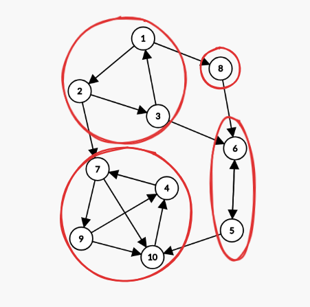

<!-- definição de SCCs - Sávio Cartaxo -->

<h1>Componentes Fortemente Conectados</h1>

Em um grafo dirigido G, diz-se que ele é fortemente conectado quando, para todo par de vértices u e v, existe um caminho de u até v e, ao mesmo tempo, um caminho de v até u. Em outras palavras, qualquer vértice pode ser alcançado a partir de qualquer outro.

No entanto, um grafo dirigido pode não ser fortemente conectado como um todo. Nesse caso, a forte conectividade pode ocorrer em apenas partes do grafo. Dizemos que dois vértices u e v são fortemente conectados entre si quando existe um caminho de u até v e outro de v até u, mesmo que u = v. Assim, mesmo que G não seja fortemente conectado, ele pode ser decomposto em subconjuntos de vértices nos quais, internamente, todo par u e v é mutuamente alcançável. Cada um desses subconjuntos induz um subgrafo chamado Componente Fortemente Conectado (CFC). Essa ideia é melhor compreendida ao observar-se o exemplo:

<figure>
    
</figure>

